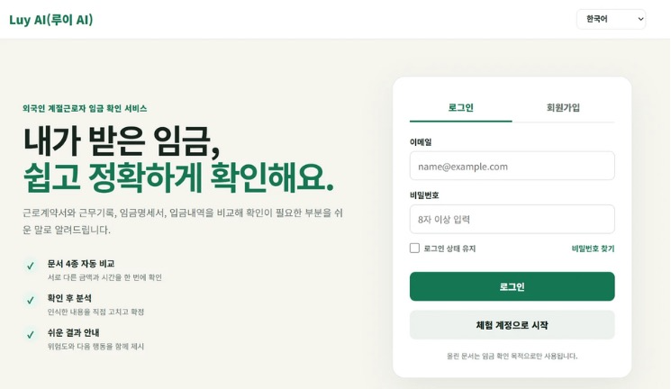
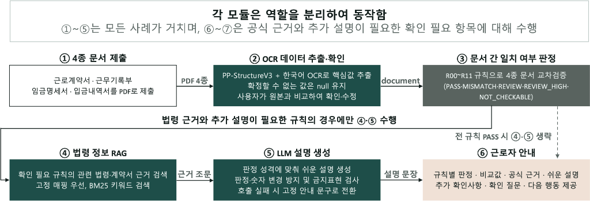
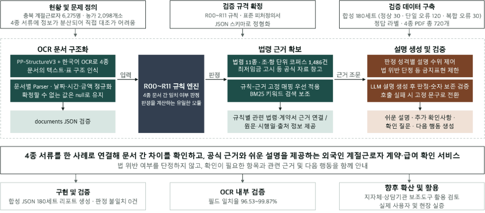
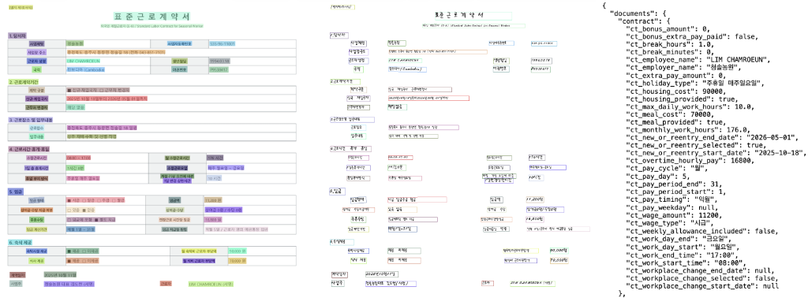

# Luy AI (루이 AI)

### 외국인 계절근로자 계약·급여 확인 서비스

> **근로계약서 → 근무기록부 → 임금명세서 → 입금내역**을 하나의 사례로 연결해 계약 내용이 실제 근무와 급여 지급에 반영되었는지 확인하고, 공식 근거와 쉬운 설명·다음 행동을 제공하는 AI 기반 디지털 시제품입니다.

`OCR` · `Human-in-the-loop` · `Rule Engine` · `Legal RAG` · `LLM` · `Multilingual UI`

<!-- 이미지: 루이 AI 메인 UI 화면 → docs/images/louie-ai-ui.png -->
<p align="center">
  
</p>

<p align="center"><sub>루이 AI 웹 UI 예시</sub></p>

> [!IMPORTANT]
> 루이 AI는 제출된 문서 사이의 차이와 추가 확인이 필요한 부분을 안내하는 **의사결정 보조 도구**입니다. 실제 법률 자문이나 최종적인 법 위반 판정을 대신하지 않습니다.

---

## 목차

1. [프로젝트 소개](#1-프로젝트-소개)
2. [문제 정의 및 기획 배경](#2-문제-정의-및-기획-배경)
3. [주요 기능](#3-주요-기능)
4. [전체 서비스 Flow](#4-전체-서비스-flow)
5. [시스템 아키텍처](#5-시스템-아키텍처)
6. [파트별 구현 내용](#6-파트별-구현-내용)
7. [R00~R11 교차검증 규칙](#7-r00r11-교차검증-규칙)
8. [기술 스택](#8-기술-스택)
9. [팀원 및 역할](#9-팀원-및-역할)
10. [검증 결과](#10-검증-결과)
11. [API 구성](#11-api-구성)
12. [한계 및 향후 개선](#12-한계-및-향후-개선)

---

## 1. 프로젝트 소개

**루이 AI**는 외국인 계절근로자가 자신의 계약 내용과 실제 근무·급여 지급 내역을 보다 쉽게 확인할 수 있도록 돕는 서비스입니다.

사용자는 아래 4종의 문서를 업로드합니다.

| 문서 | 주요 확인 정보 |
| --- | --- |
| **근로계약서** | 계약기간, 임금, 근로시간, 수당, 지급일, 식비·숙박비 |
| **근무기록부** | 근무일, 출퇴근 시각, 휴게시간, 실제 근로시간 |
| **임금명세서** | 기본급, 수당, 지급·공제항목, 총지급액·총공제액·실지급액 |
| **입금내역서** | 입금액, 입금일시, 거래내용, 분할 입금 여부 |

OCR로 추출한 값은 바로 판정에 사용하지 않습니다. 사용자가 원본 문서와 비교해 값을 직접 확인·수정하고, 실제 급여에 해당하는 입금 거래를 선택한 뒤 확정된 값만 R00~R11 규칙 엔진에 전달합니다.

루이 AI는 **판정·근거·설명의 역할을 분리**했습니다.

- **Rule Engine**: 문서 간 값 비교 및 계산·판정
- **Legal RAG**: 판정과 관련된 공식 법령·자료 연결
- **LLM**: 확정된 판정과 근거를 바탕으로 쉬운 설명·추가 질문·다음 행동 생성

생성형 AI가 임금 문제를 임의로 판단하지 않고, 결정적 규칙이 먼저 판정하도록 설계한 것이 핵심입니다.

---

## 2. 문제 정의 및 기획 배경

2026년 충청북도에는 **2,098개 농가에 외국인 계절근로자 6,275명**이 배정될 예정이며, 전년 대비 약 27.6% 증가한 규모입니다.

임금이 계약대로 지급되었는지 확인하려면 한 문서만으로는 충분하지 않습니다. 계약 조건은 근로계약서, 실제 근무내용은 근무기록부, 지급·공제 내용은 임금명세서, 실제 입금액과 지급 시점은 입금내역서에서 각각 확인해야 합니다.

하지만 정보가 여러 문서에 분산되어 있고 형식과 항목명이 서로 다르며, 시간급 환산·근로시간 계산·지급 및 공제 합계 검산까지 필요합니다. 특히 한국어와 노동 관련 용어에 익숙하지 않은 외국인 근로자가 직접 비교하기에는 부담이 큽니다.

기존 번역 서비스, 일반 OCR, 임금계산기는 개별 문서 해석이나 사용자가 입력한 값의 계산에는 도움을 줄 수 있지만, **계약 → 실제 근무 → 임금명세 → 실제 입금**의 흐름을 한 번에 연결해 확인하기는 어렵습니다.

루이 AI는 이 간극을 줄이기 위해 4종 문서를 하나의 사례로 묶어 필드 단위로 교차검증하고, 확인이 필요한 이유와 공식 근거, 다음 행동까지 함께 제공합니다.

---

## 3. 주요 기능

### 3.1 4종 문서 OCR 및 구조화
- 표준근로계약서, 근무기록부, 임금명세서, 입금내역서 PDF 처리
- 날짜·시간·금액 정규화
- JSON Schema v6 기준 canonical data 생성
- 불확실한 값은 임의로 추정하지 않고 `null`로 유지

### 3.2 OCR 결과 사용자 확인
- 원본 문서와 OCR 추출값을 비교
- 사용자가 값을 직접 수정·확정
- 확정 전 OCR 값은 규칙 판정에 사용하지 않음

### 3.3 실제 급여 거래 선택
- 입금내역 중 급여 후보를 제시
- 실제 급여 거래는 사용자가 직접 선택
- 분할 지급을 고려해 복수 거래 선택 지원

### 3.4 R00~R11 규칙 기반 교차검증
- 임금, 근로시간, 수당, 공제, 실수령액, 입금액, 지급일, 최저임금 등을 비교
- 필요한 정보가 부족한 경우 임의로 정상/오류 처리하지 않고 `NOT_CHECKABLE`로 구분
- 계산 과정에서 발생할 수 있는 반올림·표기 차이는 규칙별 시스템 내부 허용오차로 처리

### 3.5 공식 근거 기반 Legal RAG
- 국가법령정보 공동활용 OPEN API를 이용한 공식 법령 수집
- 관련 조문을 Rule별로 우선 매핑
- 고정 매핑으로 부족한 경우 BM25 검색으로 보완
- 공휴일·대체공휴일은 한국천문연구원 특일정보 API 활용
- 최저임금은 공식 고시값을 별도 관리

### 3.6 LLM 설명 및 안전장치
- OpenAI `gpt-4.1-mini` 활용
- 쉬운 설명, 추가 확인사항, 추가 질문, 다음 행동 생성
- 판정값·비교값·공식 근거는 변경하지 못하도록 제한
- 숫자 변경 및 과도한 법적 단정 표현 검사
- LLM 호출 실패 시 규칙별 고정 문구로 fallback

### 3.7 한국어·캄보디아어 UI
- 한국어 / 캄보디아어 전환 지원
- 언어를 변경해도 업로드 파일과 현재 입력 상태 유지
- OCR 필드, 거래 선택, 규칙 상태, 결과 요약 등 동적 화면도 번역

---

## 4. 전체 서비스 Flow

<p align="center">
  
</p>

사용자는 **4종 문서 제출 → OCR 결과 확인·수정 → R00~R11 규칙 판정 → 공식 근거 조회 → LLM 설명 → 결과 확인** 순서로 서비스를 이용합니다.

모든 사례에서 LLM을 호출하는 것이 아니라, **공식 근거와 추가 설명이 필요한 확인 필요 규칙에 대해서만 Legal RAG와 LLM 단계를 수행**하도록 구성했습니다. 전 규칙이 `PASS`인 경우에는 추가 생성 단계를 생략합니다.

<!-- 이미지: 사용자 서비스 Flow 차트 → docs/images/service-flow.png -->

---

## 5. 시스템 아키텍처

<p align="center">
  
</p>

아키텍처는 **OCR 문서 구조화 → R00~R11 규칙 엔진 → 법령 근거 확보 → LLM 설명 생성**으로 이어지며, 각 모듈의 역할을 분리했습니다. 입력·판정·근거·설명을 각각 독립적으로 관리해 오류 원인을 추적하고 변경 범위를 제한할 수 있도록 설계했습니다.

<!-- 이미지: 시스템 아키텍처/개발 구조 차트 → docs/images/system-architecture.png -->

### 핵심 설계 원칙

1. **AI가 판정을 다시 하지 않는다.**  
   R00~R11 규칙 엔진이 비교·계산·판정을 담당하고 LLM은 설명만 담당합니다.

2. **기계가 추출한 값은 사용자가 확정한다.**  
   OCR 오인식이 최종 판정으로 바로 이어지지 않도록 Human-in-the-loop 구조를 적용했습니다.

3. **법적 근거는 공식 자료에서 가져온다.**  
   국가법령정보, 표준근로계약서, 최저임금 고시, 공휴일 API 등 공식 자료를 우선 사용합니다.

4. **불확실성을 숨기지 않는다.**  
   판정에 필요한 자료가 부족하면 `NOT_CHECKABLE`로 표시하고 추가로 필요한 정보를 안내합니다.

---

## 6. 파트별 구현 내용

### 6.1 OCR

`PP-StructureV3`와 `korean_PP-OCRv5_mobile_rec`을 이용해 4종 PDF의 텍스트·표 구조·위치 정보를 인식합니다.

문서별 Parser를 통해 필요한 필드를 추출하고, 날짜·시간·금액을 후속 모듈에서 사용할 수 있는 형태로 정규화합니다.

<p align="center">
  
</p>

<p align="center"><sub>원본 PDF → OCR 인식 영역(bbox) → JSON Schema 기반 구조화 예시</sub></p>

<!-- 이미지: 원본 PDF → OCR bbox → JSON 구조화 예시 → docs/images/ocr-pipeline-example.png -->

```text
PDF
 ↓
PP-StructureV3
 ↓
contract / timesheet / payslip / bank parser
 ↓
Normalization
 ↓
Canonical JSON (documents)
 ↓
Schema Validation
```

확정하기 어려운 값은 추측하지 않고 `null`로 반환하며, 원문 OCR text·bbox·warning 등의 정보는 provenance에 별도 저장해 오류 원인을 추적할 수 있도록 했습니다.

### 6.2 Rule Engine

OCR 이후 사용자가 확정한 canonical `documents`를 입력받아 파생값(`derived`)과 규칙별 판정(`rule_results`)을 생성합니다.

판정 상태는 다음과 같습니다.

| 상태 | 의미 |
| --- | --- |
| `PASS` | 시스템 비교 기준 안에서 확인됨 |
| `MISMATCH` | 시스템 비교 기준을 넘어 값의 차이가 확인됨 |
| `REVIEW` | 추가 확인이 필요함 |
| `REVIEW_HIGH` | 우선적으로 확인할 필요가 있음 |
| `NOT_CHECKABLE` | 현재 자료만으로 판단하기 어려움 |

> `MISMATCH`, `REVIEW`, `REVIEW_HIGH`는 모두 최종적인 법 위반 확정을 의미하지 않습니다.

### 6.3 Legal RAG

국가법령정보 공동활용 OPEN API를 이용해 근로기준법, 시행령, 최저임금법 등의 조문 본문과 조·항 번호, 시행일, 원문 정보를 수집해 법령 코퍼스를 구성했습니다.

검색은 **Rule별 고정 매핑을 우선** 사용하고, 필요한 경우 BM25 키워드 검색으로 관련 근거를 보완합니다.

- 근로기준법 / 시행령
- 최저임금법 / 시행령·시행규칙
- 표준 계절근로계약서
- 2026년 최저임금 공식 고시
- 고용노동부 공식 안내자료
- 한국천문연구원 특일정보 API

### 6.4 LLM

LLM은 다음 정보를 입력받습니다.

- Rule ID
- 판정 상태 및 사유
- 실제 비교값
- 관련 공식 근거
- 현재 부족하거나 추가 확인이 필요한 정보

그리고 아래 사용자 안내를 생성합니다.

1. 쉬운 설명
2. 비교된 값
3. 관련 공식 근거
4. 추가 확인사항
5. 필요한 경우 추가 질문
6. 다음 행동

판정·숫자·공식 근거는 결정적 데이터로 유지하며 LLM이 임의로 수정할 수 없도록 제한했습니다.

### 6.5 UI / Backend

사용자 흐름은 아래 5단계로 구성했습니다.

1. 문서 4종 업로드
2. OCR 추출값 확인 및 수정
3. 실제 급여 입금 거래 선택
4. 분석 전 최종 확인
5. R00~R11 결과 및 법령 안내 확인

Backend는 Python 기반 HTTP API를 제공하며 Frontend는 `fetch`를 통해 API를 호출합니다.

---

## 7. R00~R11 교차검증 규칙

| Rule | 검증 내용 | 성격 | 주요 참고 근거 |
| --- | --- | --- | --- |
| **R00** | 사례 연결 | 시스템 규칙 | 표준피처정의서 |
| **R01** | 계약 ↔ 명세 임금 비교 | 문서 정합성 | 근로기준법 제17조·제48조 |
| **R02** | 근무 ↔ 명세 시간 비교 | 문서 정합성 | 시행령 제27조의2, 제50조·제54조 |
| **R03** | 상여·수당 비교 | 문서 정합성 | 제17조, 조건부 제55조·제56조 |
| **R04** | 식비·숙박비 공제 비교 | 문서 정합성 | 표준근로계약서, 제43조 |
| **R05** | 지급항목 합계 검산 | 산술 검산 | 제48조, 시행령 제27조의2 |
| **R06** | 공제항목 합계 검산 | 산술 검산 | 제48조, 시행령 제27조의2 |
| **R07** | 실수령액 검산 | 산술 검산 | 시스템 계산 규칙, 제48조 참고 |
| **R08** | 실수령액 ↔ 실제 입금액 비교 | 법적 기준 관련 | 제43조 제1항 |
| **R09** | 계약 지급일 ↔ 전액 지급 완료일 | 법적 기준 관련 | 제43조 제2항, 표준계약서, 공휴일 |
| **R10** | 계약 ↔ 실제 근로시간 확인 | 문서 정합성 | 표준근로계약서, 제63조 조건부 |
| **R11** | 환산시급 ↔ 최저임금 비교 | 법적 기준 관련 | 최저임금법 제5조의2·제6조 |

### 시스템 내부 허용오차

문서의 반올림·표기 방식 때문에 계산이 개입하는 일부 Rule에는 오탐을 줄이기 위한 내부 허용오차를 사용합니다. **법적으로 허용되는 범위를 의미하지 않습니다.**

| Rule | 허용오차 |
| --- | --- |
| R01 | 시간급 환산 시 10원 |
| R02 | 총 근로시간: 근무일수 × 5분, 하한 0.5시간·상한 계산시간의 3% |
| R02 | 연장시간: 연장 발생일수 × 5분, 하한 0.5시간 |
| R03 | 정액 항목 10원 |
| R03 | 시간 연동 항목: 10원 + (3원 × 해당 항목 시간) |
| R06 | 60원 + (2원 × 실근로시간 환산값) |
| R07 | 70원 + (5원 × 실근로시간 환산값) |

직접 비교가 가능한 R01 명시 단가, R02 근무일수, R04, R05, R08, R09, R11은 별도의 수치 허용오차를 두지 않습니다.

---

## 8. 기술 스택

| Category | Technology |
| --- | --- |
| **Language** | Python 3.11, JavaScript |
| **Frontend** | HTML, CSS, JavaScript |
| **Backend** | Python HTTP Server |
| **OCR** | PaddleOCR, PP-StructureV3 |
| **OCR Recognition** | `korean_PP-OCRv5_mobile_rec` |
| **Data Contract** | JSON Schema v6 |
| **Rule Engine** | Python |
| **Legal Data** | 국가법령정보 공동활용 OPEN API |
| **Retrieval** | Rule-based Mapping, BM25 |
| **Holiday Data** | 한국천문연구원 특일정보 API |
| **LLM** | OpenAI `gpt-4.1-mini` |
| **Output** | JSON, Markdown, Web UI |

OCR 성능 검증 환경에는 PaddleOCR 3.7.0, PaddleX 3.7.2, PaddlePaddle GPU 3.3.0, CUDA 12.9, RTX 3070을 사용했습니다.

---


## 9. 팀원 및 역할

| 이름 | 담당 파트 | 핵심 작업 | 사용 기술 |
| --- | --- | --- | --- |
| **김영진** | 합성데이터 · 법령 RAG/LLM · Rule 연계 | 법령 API 기반 코퍼스·law 데이터 구축, 규칙-법령 검색 연계, GPT 기반 불일치 설명 구현, R02·R03 허용오차·필요 피처 정의 | Python · 법령 데이터 API · OpenAI GPT API · NLP |
| **김은영** | 기획 · 데이터/합성데이터 · RAG/LLM 콘텐츠 · 검증 | 서비스·데이터 구조 및 Rule 피처 정리, R01·R10·R11 기준 설계, R00~R11 단일 오류 합성데이터 제작, 법령·LLM 콘텐츠 설계, 180세트 결과 검증 | JSON · RAG · Prompt Engineering · Synthetic Data |
| **김채영** | OCR · 문서 파싱 | OCR 모델 비교·선정, PP-StructureV3 기반 4종 문서 OCR·Parser 개발, 항목 매칭·정규화 및 JSON Schema 변환·성능 검증 | Python · PaddleOCR · PP-StructureV3 · JSON Schema |
| **양승모** | OCR · 데이터 구조화 | 4종 문서 OCR 텍스트 추출, 결과 후처리·주요 필드 정규화, 표준 JSON Schema 구조화 | Python · PaddleOCR · PaddlePaddle · JSON Schema |
| **유성호** | Rule Engine · UI/Backend | R00~R11 검증 로직 및 상태·계산 근거 구조화, OCR 확인·급여 거래 선택·결과 UI 구현, Python API·다국어 화면·공휴일 검증을 전체 서비스 흐름으로 통합 | Python · JavaScript · HTML/CSS · JSON Schema · OpenAI API |

---

## 10. 검증 결과

### 10.1 OCR 기준선 검증

개발에 직접 사용하지 않은 **36 case · 144 PDF**를 대상으로 4종 문서 OCR/Parser 파이프라인을 검증했습니다.

| 항목 | 결과 |
| --- | ---: |
| Regression case | **36 / 36** |
| OCR 처리 | **144 / 144 PDF** |
| Parser 처리 | **144 / 144 document** |
| documents Schema Validation | **36 / 36** |

문서별 평가 가능한 non-null field와 정답값(GT)을 비교한 기준선은 다음과 같습니다.

| 문서 | 필드 일치율 |
| --- | ---: |
| 근로계약서 | **99.53%** |
| 근무기록부 | **99.87%** |
| 임금명세서 | **99.66%** |
| 입금내역서 | **96.53%** |

> 해당 수치는 합성 PDF 기준 OCR 성능 기준선입니다. 최종 v6 전환 후에도 OCR 대상 필드 구조와 Parser 추출 로직은 유지되었지만, 실제 촬영문서의 성능을 보장하는 수치는 아닙니다.

### 10.2 Legal RAG·LLM 검증

정상 30세트, 단일 오류 120세트, 복합 오류 30세트로 구성된 **총 180세트 합성 JSON**을 대상으로 법령 근거 조회와 설명 생성 파이프라인을 검증했습니다.

| 항목 | 결과 |
| --- | ---: |
| 입력 JSON | **180** |
| 생성 리포트 | **180** |
| 누락 리포트 | **0** |
| 빈 리포트 | **0** |
| 비PASS Rule | **215건** |
| 원본 판정 ↔ 생성 리포트 판정 불일치 | **0건** |

이를 통해 **규칙 판정 완료 JSON → 법령 근거 조회 → 설명 생성 → 리포트 저장** 과정에서 기존 판정이 변경되지 않음을 확인했습니다.

> RAG·LLM 180세트 검증은 규칙 판정이 완료된 합성 JSON을 입력한 구간에 대한 검증이며 OCR 탐지 성능과는 구분됩니다.

### 10.3 통합 시제품 검증

최종 시제품에서는 다음 흐름이 연결되어 동작함을 확인했습니다.

- PDF 4종 업로드
- OCR 및 Parser 처리
- 사용자 추출값 수정
- 실제 급여 거래 선택
- R00~R11 규칙 판정
- 공식 법령 근거 연결
- LLM 설명 생성
- 한국어·캄보디아어 화면 전환

추가로 다음 항목을 확인했습니다.

- Python 3.11 규칙 엔진 단위 테스트 통과
- JavaScript 문법 검사 통과
- 최종 v6 JSON Schema 검증 통과
- 공휴일 API 실제 조회 성공
- OpenAI API 구조화 출력 6개 필드 생성 성공
- LLM 설명 과정에서 기존 규칙 판정 변경 없음

---

## 11. API 구성

### API

| Method | Endpoint | Description |
| --- | --- | --- |
| `GET` | `/api/health` | 서버, Schema, OCR 장치 및 모델 캐시 상태 확인 |
| `GET` | `/api/demo` | 예시 문서 데이터 제공 |
| `POST` | `/api/ocr` | PDF 4종 OCR 및 v6 `documents` 생성 |
| `POST` | `/api/evaluate` | 사용자 확정 데이터를 받아 규칙 판정 및 법령 설명 생성 |

### OCR Runtime

OCR 모듈은 애플리케이션 시작 시 `OCRPipeline`을 초기화하고 여러 문서 요청에서 재사용하도록 구성했습니다.

최종 OCR 처리 결과에서는 아래 상태를 확인합니다.

```python
report["status"] == "success"
report["validation"]["ocr_documents_schema_valid"] is True
```

### 환경 변수

외부 API 키와 LLM API 키는 코드에 직접 저장하지 않고 환경 변수 또는 `.env`로 관리합니다.

> API Key, 개인정보, 실제 근로자 문서는 Repository에 commit하지 않습니다.

---

## 12. 한계 및 향후 개선

### 현재 한계

- OCR 성능은 합성 PDF 기준으로 검증했으며, 실제 촬영문서에서는 화질·표 구조·은행 양식 등에 따라 정확도가 달라질 수 있음
- 일부 거래행·근무기록·Checkbox·날짜 등에서 OCR/Parser 오류가 발생할 수 있어 추가 고도화가 필요함
- 사업장 업종, 별도 합의, 지역별 행정지침 등 입력되지 않은 사실은 판단할 수 없으며 최종 법률 판단을 대신하지 않음
- 캄보디아어 사용자 검증과 기관 도입을 위한 계정·권한·이력 관리·개인정보 보호 기능은 추가 검증 및 구현이 필요함

### 향후 개선 방향

1. 실제 촬영문서 기반 OCR·Parser 성능 평가 및 고도화
2. 캄보디아어 원어민 검수와 외국인 근로자·기관 담당자 사용자 테스트
3. 계정·권한·이력 관리·개인정보 마스킹 등 기관형 기능 추가
4. 다른 지역·은행·언어·업종 및 4대보험·퇴직금 등 인접 영역으로 확장

---

## 프로젝트 상태

**디지털 시제품 / MVP**

현재 루이 AI는 **PDF 업로드 → OCR → 사용자 확인·수정 → 급여 거래 선택 → R00~R11 판정 → 공식 근거 연결 → LLM 설명 → 한국어·캄보디아어 UI**까지 전체 사용자 흐름이 연결된 웹 시제품 단계입니다.

